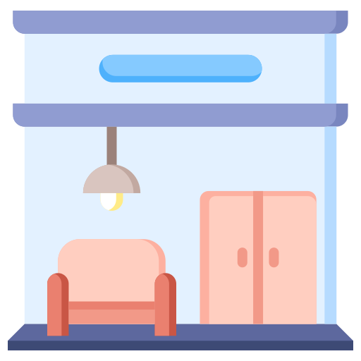

<p align="center">
  
</p>

# NORDHEM - IKEA-style Home & Room Essentials

A small e-commerce store for selling home & room essentials, built as a course project. The chosen course topic is **price differentiation**: every product comes in three tiers - **Basic**, **Standard**, **Premium** - surfaced consistently across the homepage, catalog, product page, cart, and checkout.

The project is implemented as a **dynamic website with a database**: HTML and CSS for structure and design, vanilla JavaScript for the dynamic behaviour, and a MySQL-compatible SQL schema for the data model.

## Tech stack

- HTML, CSS, Vanilla JavaScript
- SQL schema (SQLite-friendly DDL, easily portable to MySQL/PostgreSQL)
- Prettier extension to format code for better readability
- `localStorage` for cart persistence in the static demo

## Running the site

**Option A - VS Code Live Server**

1. Install the *Live Server* extension.
2. Right-click `index.html` → **Open with Live Server**.

**Option B - any local HTTP server**

```powershell
# from the project root
python -m http.server 5500
# then open http://localhost:5500
```

You can also double-click `index.html` and it will run.

## How the project meets the assessment

### Pages

The site has 7 linked pages — home, shop, product, cart, checkout, about, and contact — all sharing a common header and footer. This exceeds the minimum of 5 pages required by the assignment.

### Images

Every product card and product detail page displays a product image. The homepage hero and category section also use images. Product images are loaded dynamically from the data layer.

### Video

The homepage includes an embedded YouTube video (`<iframe>`) in a dedicated "Our story" section, showcasing the brand and product style.

### Hyperlinks

Navigation links connect all pages via the header and footer. Additional in-page links include category shortcuts in the footer, a "Continue shopping" link from cart/checkout, and anchor links..

### Lists

Unordered lists (`<ul>/<li>`) are used for the feature bullets on the homepage hero, and are rendered dynamically on the product page to display per-tier feature lists inside the specification table.

### Tables

The product page renders a `<table>` dynamically via JavaScript that compares the three pricing tiers (Basic, Standard, Premium) side by side, showing price, features, and an "Add to cart" button for each tier.

### Design and usability

Clean, consistent styling with a shared CSS file, simple navigation, product search, category and tier filters, and sort controls on the shop page. The layout is responsive for both mobile and desktop.

### Dynamic behaviour (JavaScript)

The product catalog, product page, cart, and checkout are all built from a shared data layer. The cart persists across page reloads using `localStorage`. Checkout and contact forms are validated before submission.

### Database

A MySQL-compatible SQL schema (`database/schema.sql`) defines the full data model: categories, products, pricing tiers, and stock levels, with foreign keys and seed data matching the live site.

## Topic Integration

The store includes the following topics from the project list:

- **Main Topic: Price Differentiation**: every product comes in three pricing tiers (Basic, Standard, Premium), each with its own price and feature set, shown across the cards, product page, shop filter, cart, and checkout.
- **Recommendation Systems**: the product page shows a "You may also like" row that suggests related products from the same category.
- **Digital Nudging**: the Standard tier is pre-selected as the default option, and each product shows its stock level ("In stock (n)" or "Out of stock") to create a sense of scarcity. Ratings and review counts act as social proof.

## Main features

- 20 products in 3 tiers across 6 categories
- Filter by category and tier, search, and sort
- Product page with gallery, tier choice, and stock info
- Cart with add / update / remove and free shipping over €200
- Validated checkout and contact forms
